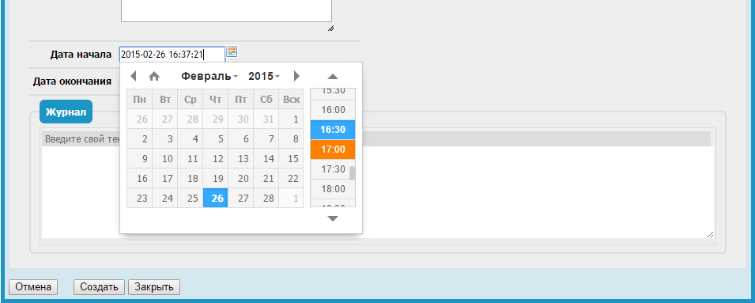

datetimepicker-widget (ru)
===================================
*Scroll down for English.*

Удобный виджет выбора даты и времени для [Combodo iTop 2.1](http://combodo.com/itop).


Этот модуль заменяет стандартный виджет выбора даты и времени на вот [этот](https://github.com/xdan/datetimepicker):


### Установка
Устанавливаем, как и любой другой модуль в iTop:
 1. Перекладываем папку *datatimepicker-widget* в *itop/extensions/*.
 2. Разрешаем редактирование config-файла iTop *itop/conf/production/config-itop.php*.
 3. Переходим в браузере http://my-itop/setup и выбираем "Upgrade an existing iTop instance".
 4. На предпоследнем шаге ставим галочку напротив названия модуля и устанавливаем.
 5. Готово.

### Настройка
После установки модуля в config-файле добавятся параметры виджета, доступные для редактирования.
```
'datetimepicker-widget' => array (
  'default' => array(
    'lang' => 'ru',
    'dayOfWeekStart' => 1,
    'step' => 30
  )
),
```
Возможные значения параметров смотри в [документации к плагину](http://xdsoft.net/jqplugins/datetimepicker/).

### Ограничения
- Формат может быть только такой: `Y-m-d H:i`.

### Дальнейшие планы
- Добавить поддержку различных настроек для разных полей.

### Ссылки
- [iTop ITSM & CMDB по-русски](http://community.itop-itsm.ru)
- [Сайт Combodo iTop](http://www.combodo.com/itop)
- [DateTimePicker jQuery plugin](http://xdsoft.net/jqplugins/datetimepicker/)


datetimepicker-widget (en)
===================================
*Русский язык вверху*

Friendly date and time picker wedget for [Combodo iTop 2.1](http://combodo.com/itop).


This module replaces the standard date and time picker widget with [this one](https://github.com/xdan/datetimepicker):


### Installation
Install like any other module in iTop:
 1. Copy folder *datatimepicker-widget* to *itop/extensions/*.
 2. Make editable iTop config file *itop/conf/production/config-itop.php*.
 3. Go to http://my-itop/setup in your browser and select "Upgrade an existing iTop instance".
 4. Check the module name on the penultimate step and install.
 5. Done.

### Configuration
Some options will be added in the config file after the module installing.
```
'datetimepicker-widget' => array (
  'default' => array(
    'lang' => 'ru',
    'dayOfWeekStart' => 1,
    'step' => 30
  )
),
```
For other options and available values look through [documentation for the plugin](http://xdsoft.net/jqplugins/datetimepicker/).

### Limitations
 - Only this date and time format is allowed: `Y-m-d H:i`.

### Future plans
- Add support different settings for specific date and time fields.

### Links
- [iTop ITSM & CMDB russian community](http://community.itop-itsm.ru)
- [Combodo iTop website](http://www.combodo.com/itop)
- [DateTimePicker jQuery plugin](http://xdsoft.net/jqplugins/datetimepicker/)
